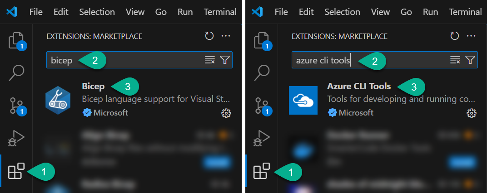
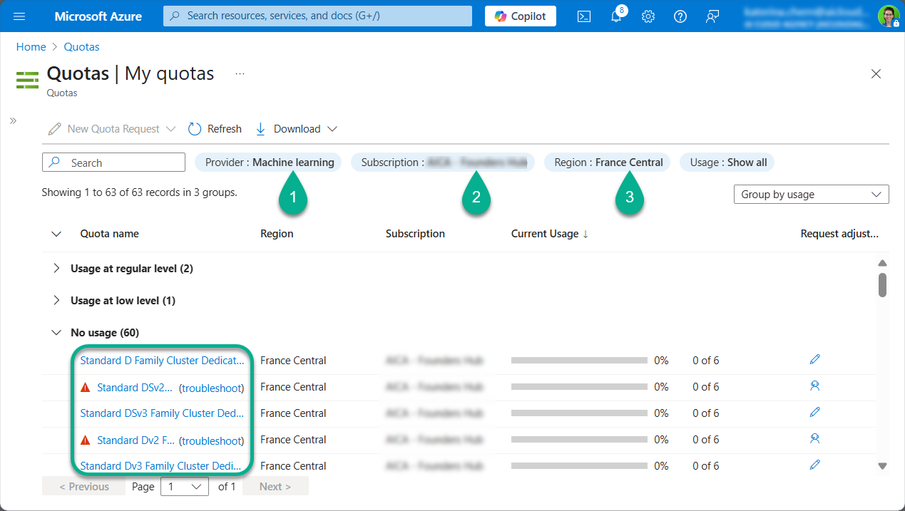

European Power Platform Conference | Workshop

# From Concept to Intelligent Agent. Build AI Agents with Microsoft Copilot Studio and Azure AI Foundry

*Workshop level: 300*

👨‍💻 **Audience:** Developers, Solution Architects, Power Platform or Azure AI practitioners

🗓️ **Date:** June 16, 2025

📍 **Where:** [Austria Center Vienna](https://www.acv.at/de/)

🎟️ [Get a ticket!](https://www.sharepointeurope.com/events/from-concept-to-intelligent-agent-build-ai-agent-with-microsoft-copilot-studio-and-azure-ai-foundry/)

***

## Get ready for the Workshop

*This workshop is hands-on and fast-paced. You'll build a complete AI-powered agent using Microsoft Copilot Studio and Azure AI Foundry - from setup to deployment, integration, and monitoring. To keep things smooth and productive, we ask that you prepare your laptop, tools, and environment in advance. Completing these prerequisites will ensure you can fully participate in all labs without delay.*

### 💻 1. Laptop
- [ ] Bring a laptop with Windows 10/11 or macOS
- [ ] Ensure you have admin permissions to install software

### ⚙️ 2. Software to install (**before** the Workshop)

- [ ] [Azure CLI](https://learn.microsoft.com/en-us/cli/azure/install-azure-cli)
- [ ] [Postman](https://www.postman.com/downloads/)
- [ ] [VS Code](https://code.visualstudio.com/)
- [ ] VS Code Extensions:
   - [ ] Bicep
   - [ ] Azure CLI Tools
   

### 🌐 3. Azure subscription (get **before** the Workshop)
- [ ] An Azure subscription (you can [start a free trial here](https://azure.microsoft.com/en-us/pricing/purchase-options/azure-account?icid=azurefreeaccount))
>We recommend using a **dedicated** Azure subscription (trial version is sufficient) to experiment without impacting corporate environments
- [ ] Ensure that you have the Owner role assigned at the Subscription level (follow [this guide](https://learn.microsoft.com/en-us/azure/role-based-access-control/role-assignments-portal-subscription-admin) to assign the role)

- [ ] Ensure the Machine Learning quotas is available

>To check Machine Learning quotas:
>- Navigate to the Azure [Quotas page](https://portal.azure.com/#view/Microsoft_Azure_Capacity/QuotaMenuBlade/~/myQuotas)
>- Select `Machine Learning` provider
>- Select your Azure subscription
>- Select `France Central` region
>- Look for available quota for D-series VMs (at least `6 cores` should be available)
>
>- Request a quota increase if needed. Click the pencil icon to initiate a quota increase request if you find the quota is insufficient.
>
>If you receive a resource provider error:
>- Go to Subscription > Resource Providers
>- Register Microsoft.Quota and Microsoft.Compute
>- Wait a few minutes, then retry quota check

### 4. 🛡️ Power Platform

- [ ] A Microsoft 365 tenant (any Microsoft 365 license is sufficient; you can register for a 1-month Business Basic Trial [here](https://signup.microsoft.com/get-started/signup?products=91dcd8b1-3b1b-444d-9cdb-0bc0da3eb40d&mproducts=CFQ7TTC0LH18:0002&fmproducts=CFQ7TTC0LH18:0002&culture=en-us&country=us&ali=1))

- [ ] Power Platform Developer Plan (you can start the Power Apps Developer Plan [here](https://www.microsoft.com/en-us/power-platform/products/power-apps))
- [ ] Dataverse-enabled environment (follow [this guide](https://learn.microsoft.com/en-us/power-platform/admin/create-environment#create-an-environment-with-a-database) to create it)
- [ ] Assign the `System Administrator` role (follow [this guide](https://learn.microsoft.com/en-us/power-platform/admin/assign-security-roles) to assign the role)
- [ ] Get access to Copilot Studio (you can follow [this guide](https://learn.microsoft.com/en-us/microsoft-copilot-studio/sign-up-individual) to sign up for a trial)

***

## 🧠 Skills You Should Know in Advance

### 📕 Required Knowledge (self-assess):

- Azure Basics
   - Resource groups, networking, key vault, storage accounts ([learn more](https://learn.microsoft.com/en-us/training/paths/microsoft-azure-fundamentals-describe-cloud-concepts/))
   - Azure AI terminology ([learn more](https://github.com/Katerina-Chernevskaya/azure-mastery))
- Command Line (AZ CLI)
   - Run commands, use az login, switch subscriptions ([learn more](https://learn.microsoft.com/en-us/training/modules/create-azure-resources-by-using-azure-cli/))
- Bicep Basics (recommended)
   - What is Bicep, how to deploy resources (learn more [here](https://learn.microsoft.com/en-us/training/modules/implement-bicep/) and [here](https://learn.microsoft.com/en-us/training/paths/fundamentals-bicep/))
- Power Platform (basic familiarity)
   - What is a solution ([learn more](https://learn.microsoft.com/en-us/training/modules/introduction-solutions/))
   - What is Copilot Studio (learn more [here](https://learn.microsoft.com/en-us/training/modules/describe-ai-authoring-experience-power-platform/) and [here](https://github.com/Katerina-Chernevskaya/feature-a-day))


### 💡 Optional Pre-Work (Highly Recommended)
Spend ∼30 minutes completing the following:

🔎 **Lab 1: Environment Prep**
- Install AZ CLI and VS Code extensions
- Log into Azure using az login
- Check your Azure Cognitive Services usage using Azure CLI:
```
az cognitiveservices usage list -l francecentral --output table
```

🤖 **Lab 2: Get Familiar with Copilot Studio**
- Create a simple Copilot agent in the UI
- Add a static topic
- Test the conversation flow

***

## 📦 What Will Be Provided at the Workshop

✅ Pre-built Power Platform solution

✅ GitHub repo with:
   - Bicep templates
   - Prompt Flow template
   - Sample documents for AI Search
   - Sample Q&A pairs for evaluation

✅ Links to docs, troubleshooting guides, and next steps