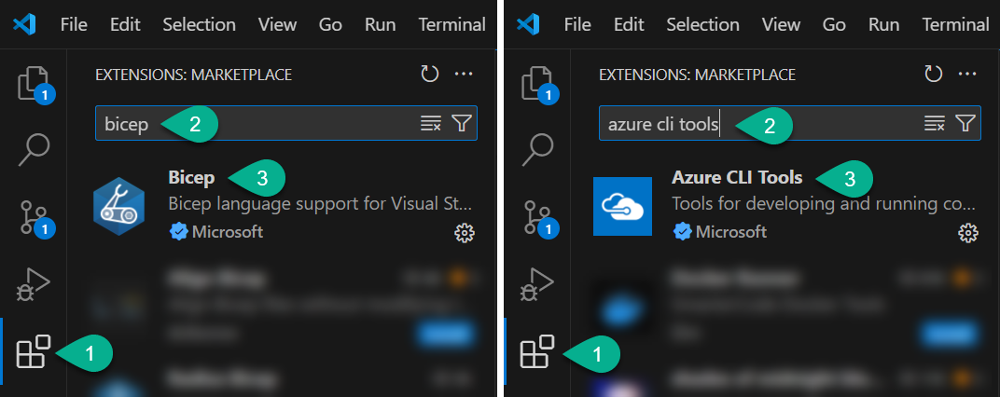
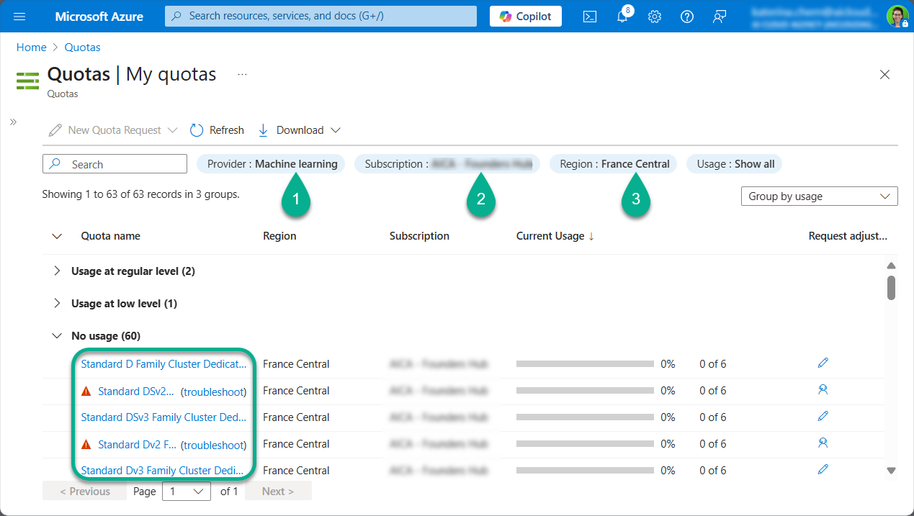
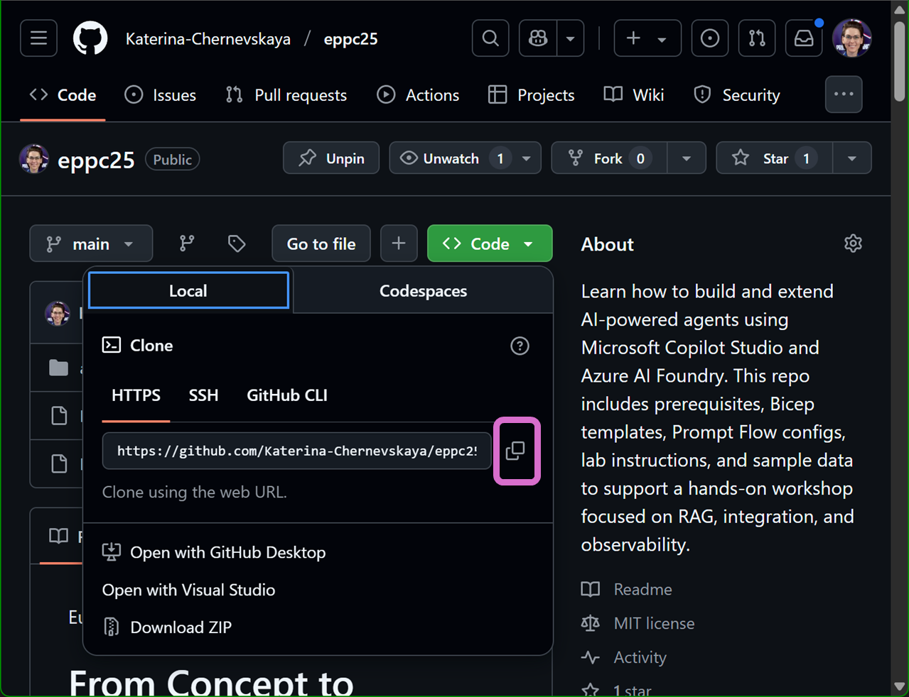
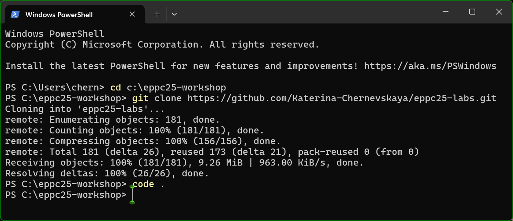

# Lab 1: Check prerequisites & Clone the Workshop Repository

*Before diving into the technical labs, we’ll make sure that all workshop prerequisites are met and that you have your own working copy of the lab materials. This lab consists of two parts:*

✅ *Verifying that all required software, services, and environments are set up*

🧬 *Forking and cloning the GitHub repository with lab instructions and resources*

## ✅ Part 1: Check prerequisites

Review the checklist below. You should have completed these steps **before the workshop**. If something is missing, please fix it now or contact your tutor during the break.

### 💻 Laptop

- [ ] Windows 10/11 or macOS
- [ ] Admin rights to install software

### ⚙️ Installed Software

- [ ] [Azure CLI](https://learn.microsoft.com/en-us/cli/azure/install-azure-cli)
- [ ] [Postman](https://www.postman.com/downloads/)
- [ ] [Visual Studio Code](https://code.visualstudio.com/)
- [ ] VS Code Extensions:

  - [ ] Bicep
  - [ ] Azure CLI Tools
    

### 🌐 Azure Subscription

- [ ] Access to a dedicated Azure subscription
- [ ] Owner role assigned at subscription level ([instructions](https://learn.microsoft.com/en-us/azure/role-based-access-control/role-assignments-portal-subscription-admin))
- [ ] Machine Learning quota available (at least **6 D-series cores** in **France Central**)
  

  > If needed, register resource providers: `Microsoft.Quota` and `Microsoft.Compute`, and request a quota increase

### 🛡️ Power Platform

- [ ] Microsoft 365 tenant
- [ ] Power Platform Developer Plan ([get started](https://www.microsoft.com/en-us/power-platform/products/power-apps))
- [ ] Dataverse-enabled environment ([guide](https://learn.microsoft.com/en-us/power-platform/admin/create-environment#create-an-environment-with-a-database))
- [ ] System Administrator role assigned ([guide](https://learn.microsoft.com/en-us/power-platform/admin/assign-security-roles))
- [ ] Access to Copilot Studio ([trial guide](https://learn.microsoft.com/en-us/microsoft-copilot-studio/sign-up-individual))

***

## 🧬 Part 2: Fork and Clone the Workshop Repository

*Now let’s fork the repository and clone it locally so you can work with lab files in your own environment.*

1. Create a folder on your laptop where you'll clone the repository. For example, you can create a folder named `eppc25-tutorial` on your `C:` drive.

2. Open the GitHub repo in your browser:
   [https://github.com/Katerina-Chernevskaya/eppc25](https://github.com/Katerina-Chernevskaya/eppc25)

3. Click the **Fork** button in the top right corner and create a copy in your own GitHub account.

4. In your forked repository, click the `Code` button and copy the `Clone URL (HTTPS)`.

    

5. Open **PowerShell** or any terminal of your choice.

6. Navigate to a working directory where you want to clone the labs using `cd` command. For example:

   ```
   cd c:\eppc25-tutorial
   ```

7. Clone your forked repo (replace with the URL you copied in step 4):

   ```
   git clone https://github.com/<YOUR_CLONE_URL>
   ```

   

8. Once cloned, open the project in **Visual Studio Code**:

   ```
   code .
   ```

***

✅ You’re now ready to start the workshop!

