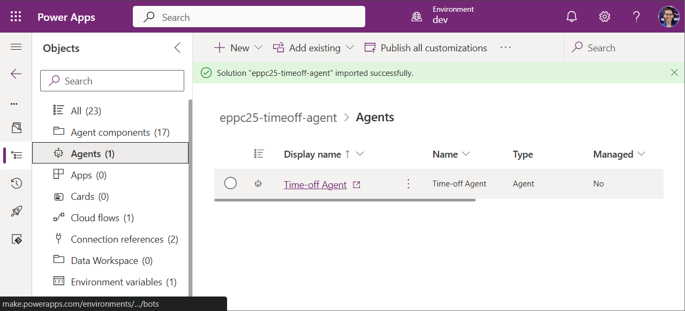
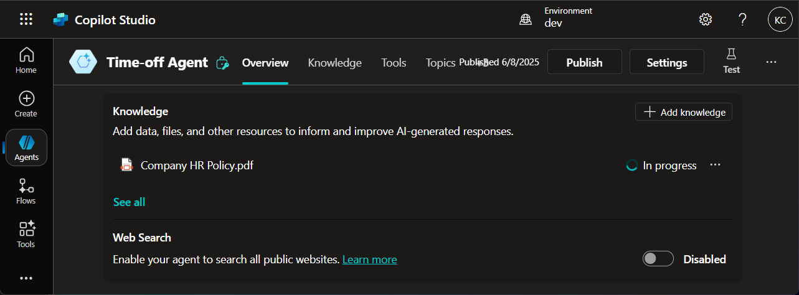
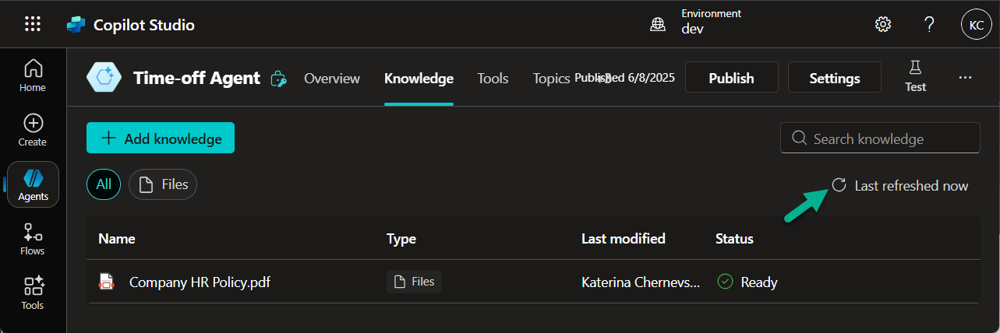
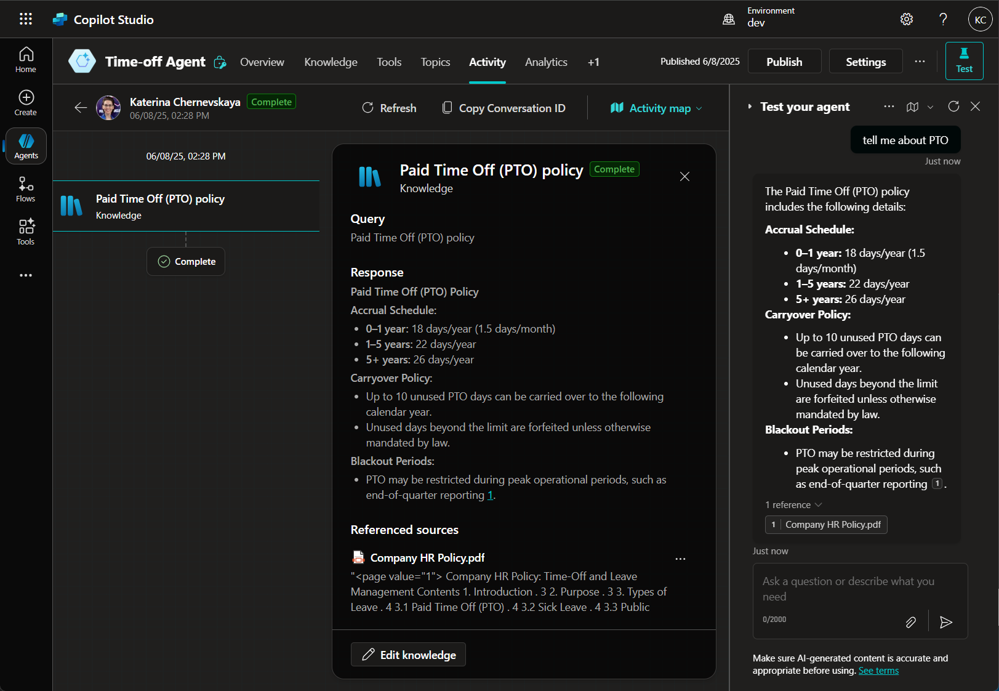
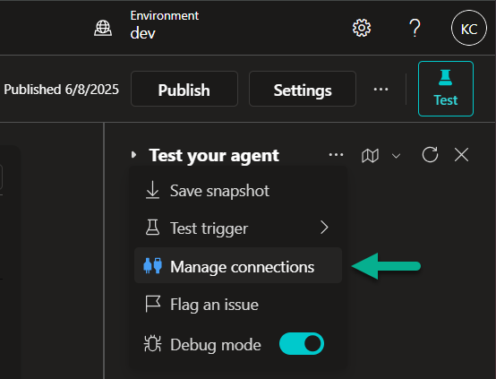
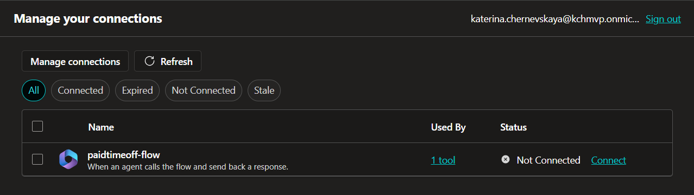
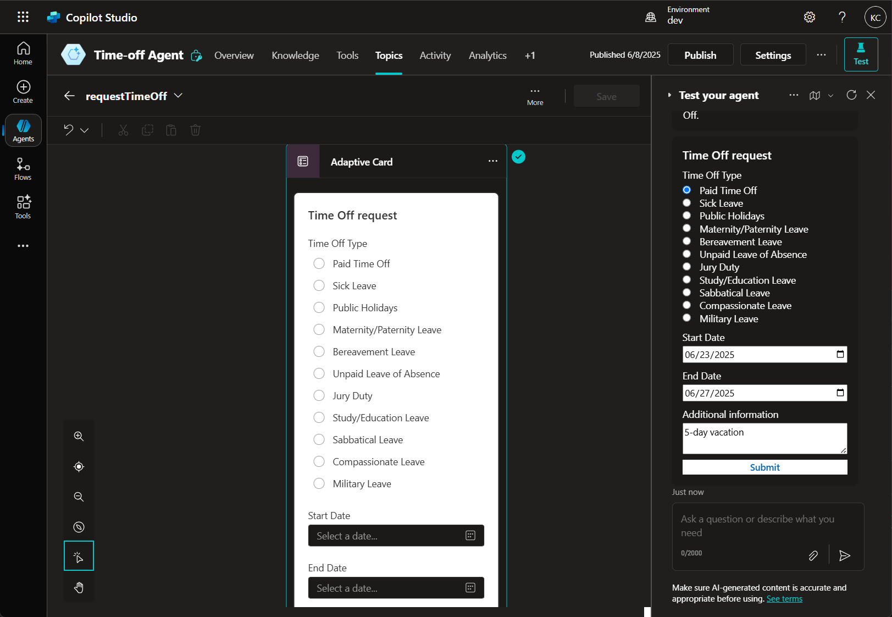
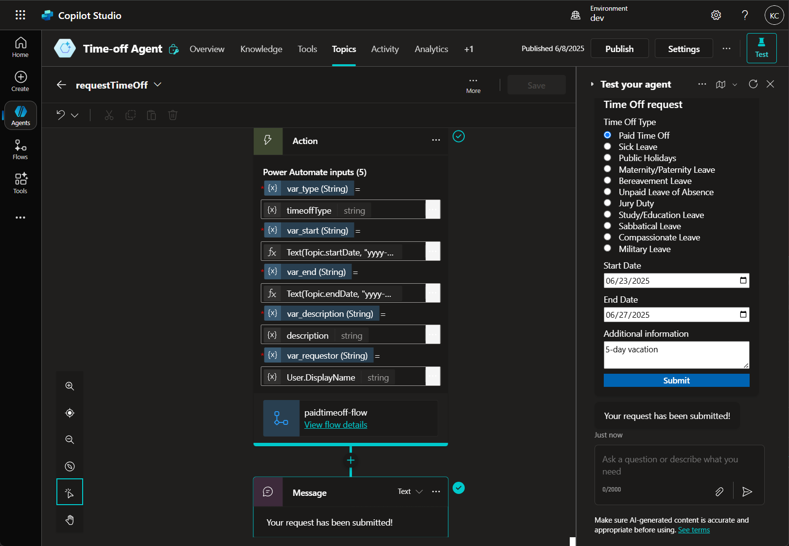

# Lab 2: Import pre-built Copilot Studio solution

*In this lab, you will import a pre-built solution containing the **Time-Off Agent** into your Power Platform environment. This solution includes the agent’s configuration, the required flow, and connections needed to handle time-off requests. Make sure you completed [Lab 1](./lab1-1.md) and downloaded the [solution package](./solution/eppc25timeoffagent_1_0_0_2.zip) beforehand.*

## Import solution

1. Open your Power Platform environment.

2. In the left navigation menu, go to the **Solutions** section and select **Import solution**.

3. Click **Browse** and locate the [solution](./solution/eppc25timeoffagent_1_0_0_2.zip) you downloaded in lab 1.

    

4. When prompted to configure connections, ensure both **Outlook** and **Dataverse** connections are properly set up. Click **Next** to continue.

5. In the final step, enter the **email address** where notifications about new time-off requests should be sent, then click **Import** to complete the process.

***

## Explore the Agent

1. After the solution is successfully imported, open it and navigate to the **Agents** section.

2. Select and open the **Time-off Agent**.

    

3. Review the agent's configuration, including its **Description**, **Instructions**, and **Knowledge** section.

4. In the **Knowledge** tab, wait until the uploaded document reaches the **Ready** status.

    

    You can click the **Refresh** button to update the document status.

    

***

## Test the generative answer

1. Open the **Test** pane on the right-hand side of the agent editor.

2. Type a question, for example:

    ```
    tell me about PTO
    ```

3. You should receive a generative answer based on the uploaded HR policy document.

    

***

## Test the Agent flow

1. In the **Test** pane, click on three-dot menu (...) and select **Manage connections**.

    

2. In the new window, click **Connect** to ensure all required services are active.

    

3. Return to the Agent and in the **Test** pane enter:

    ```
    I want to take a vacation
    ```

4. The agent will walk you through a form. Fill in the details:

    - Type of leave (e.g., PTO)
    - Start and end dates
    - Notes or comments

5. Once you're ready, click **Submit**.

    

6. After submission, you should receive a confirmation message that your time-off request was successfully submitted.

    

