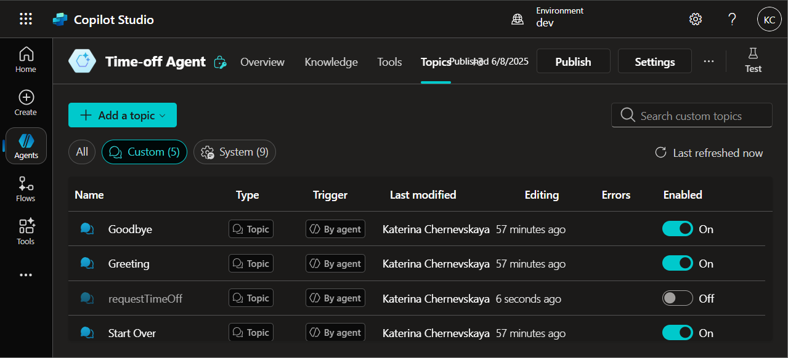
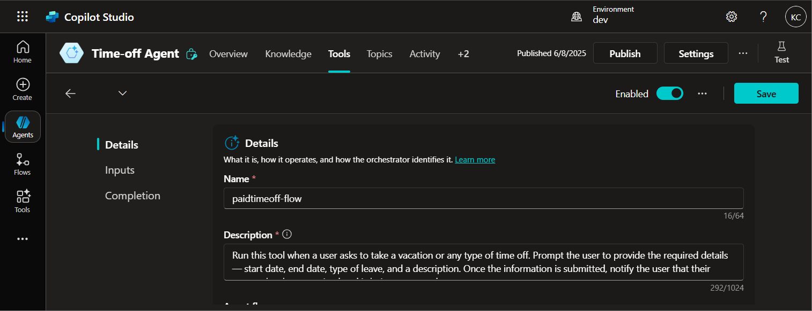
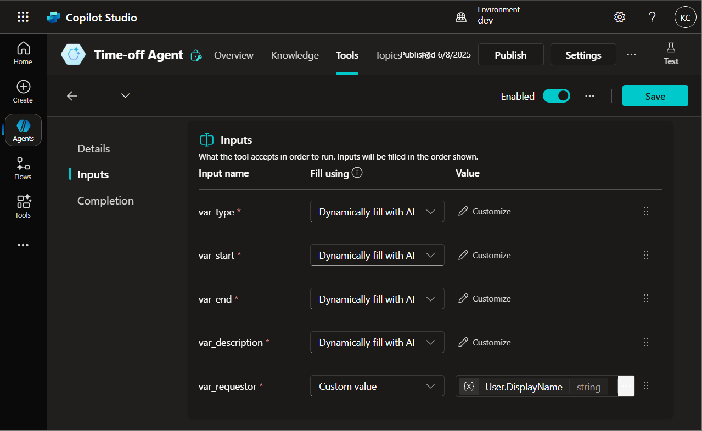
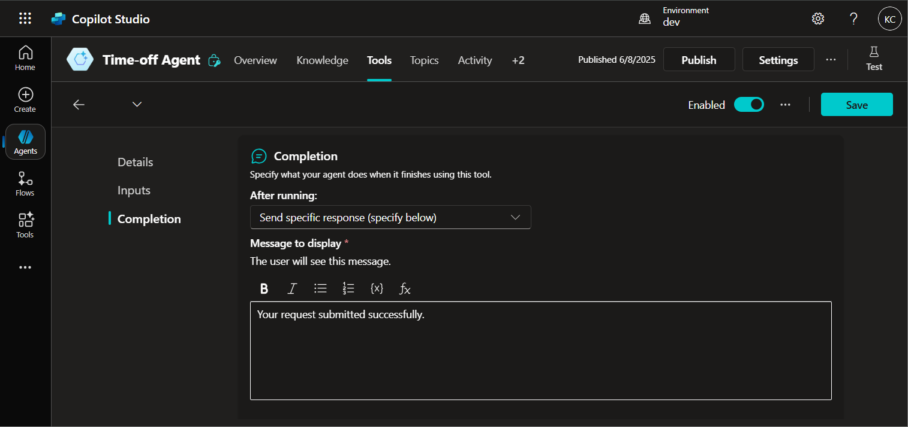
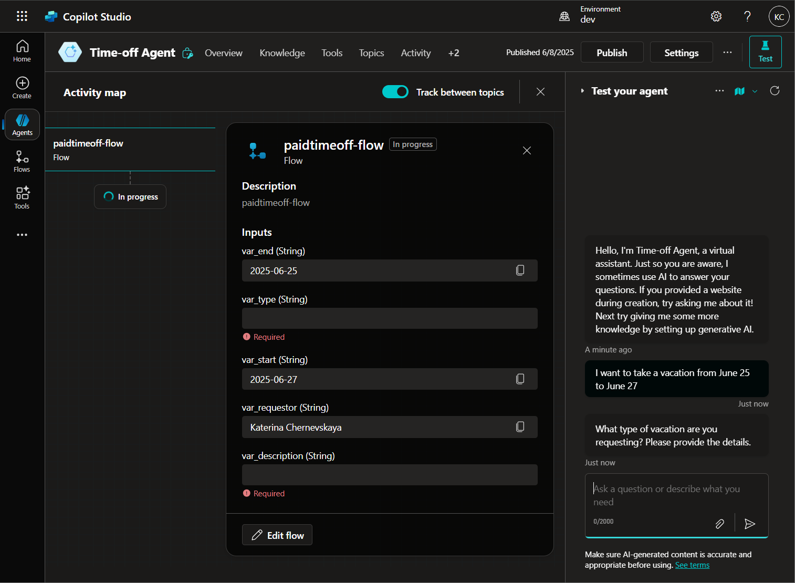
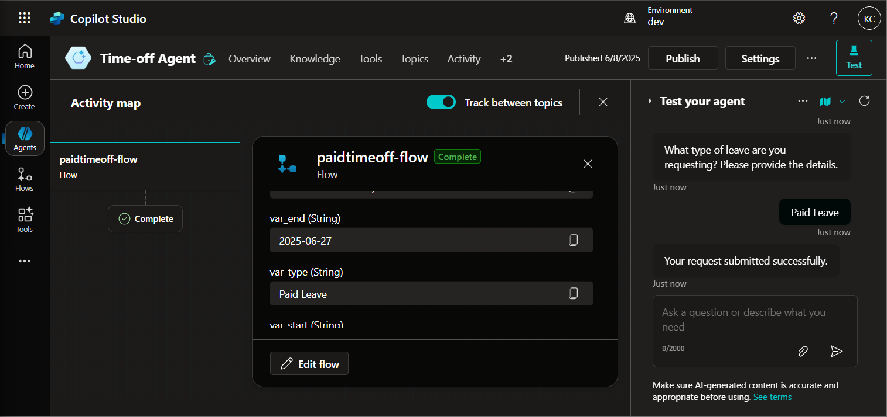

# Lab 3: Create a new custom action 

*In this lab, you’ll configure a custom tool that handles time-off requests by extracting information directly from the user’s message. You will disable the custom topic and instead use a tool powered by Agent Flow to process the request, extract parameters, and notify the user with a confirmation message.*

## Configure the tool

1. Go to the **Topics** section and turn off the **requestTimeOff** topic.

    

2. Navigate to the **Tools** section and open the **paidtimeoff-flow** tool.

3. Update the **Description** field with the following text:

    ```
    Run this tool when a user asks to take a vacation or any type of time off. Prompt the user to provide the required details — start date, end date, type of leave, and a description. Once the information is submitted, notify the user that their request has been received and is being processed.
    ```

    

4. Go to the **Inputs** tab. For the input named **var_requestor**:

    - Change the **Value type** to **Custom value**
    - For the value, select the variable `System.User.DisplayName`

    

5. In the **Completion** section:

    - For **After running**, select **Send specific response (specify below)**
    - Enter the message:

    ```
    Your request submitted successfully.
    ```

    

6. Click **Save** to finalize the changes to the tool.

***

## Test the tool

1. Open the **Test** pane and start a new conversation.

2. Enter the following phrase:

    ```
    I want to take a vacation from June 25 to June 27
    ```

3. The tool should be triggered automatically, and the agent will extract the dates from the input.

    

4. Provide the remaining required details when prompted:

    - **Type of leave:** `Paid Leave`
    - **Description:** `3-day vacation`

5. After the request is processed and stored in Dataverse, you should receive a confirmation message.

    
