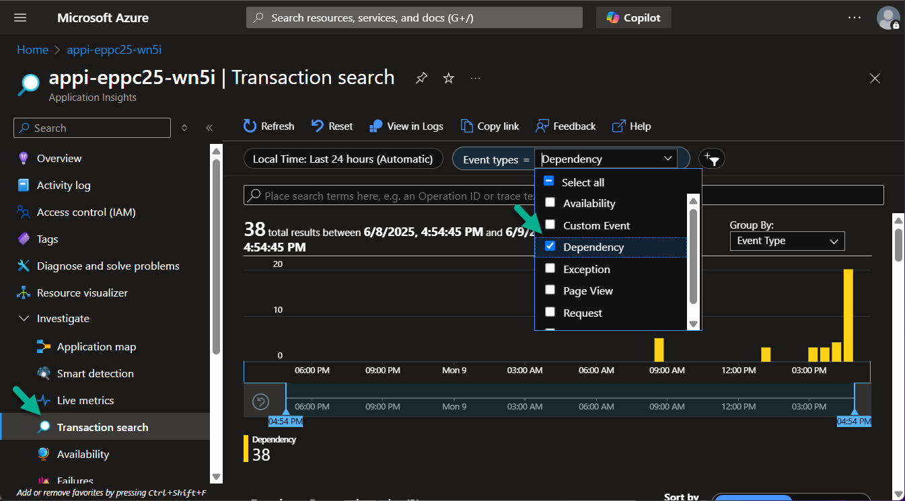
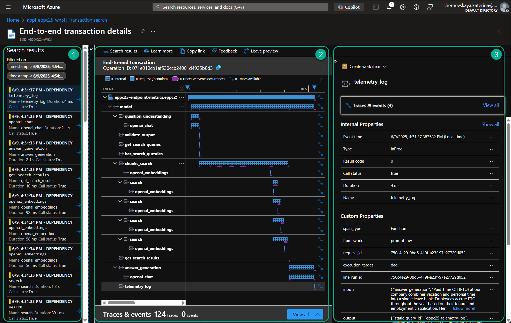
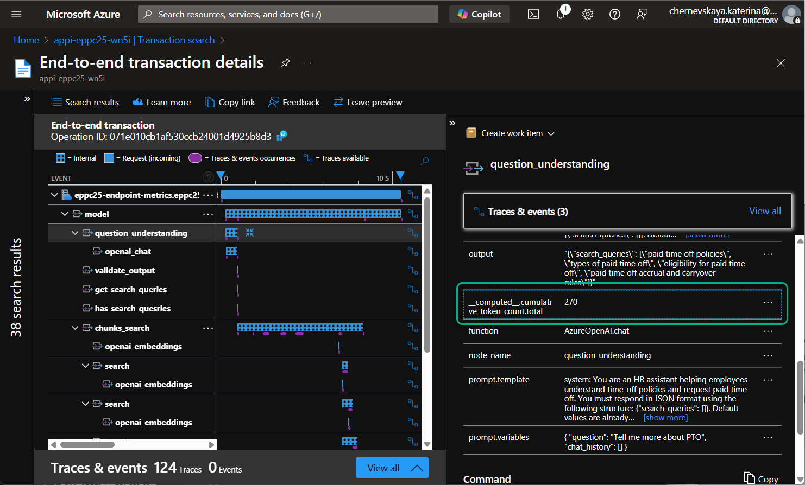
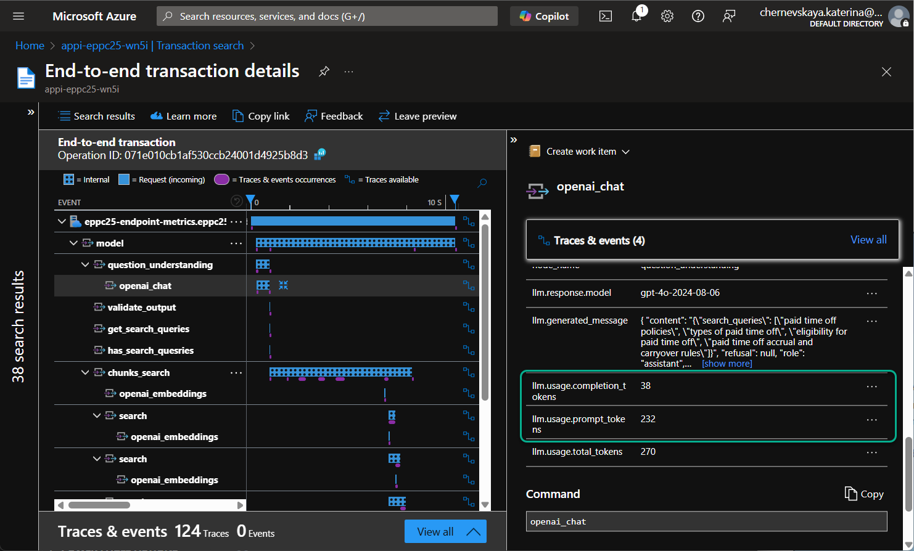
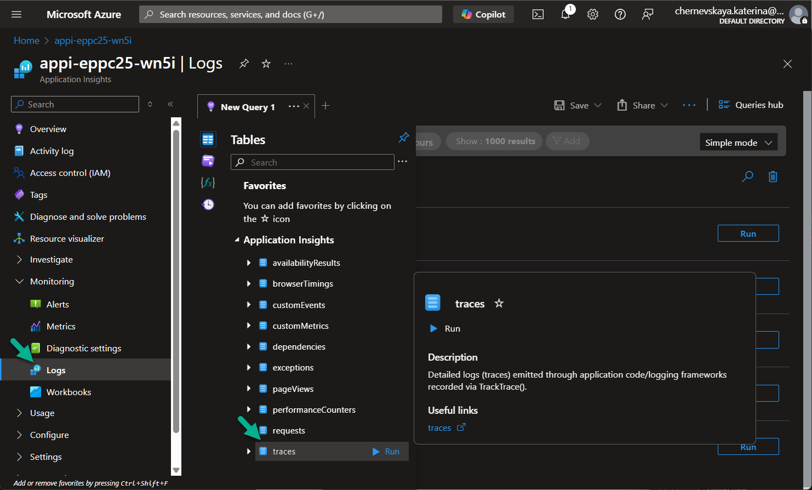
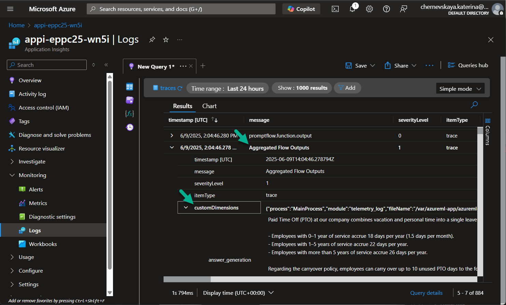

# Lab 12: Review logs in Application Insights

*In this lab, you’ll explore how to use Azure Application Insights to monitor and debug your Prompt Flow. Application Insights provides deep observability into your flow execution, including token usage, latency, and custom telemetry logged by your Prompt Flow.*

*By the end of this lab, you will:*

*- Understand how to read structured telemetry using Transaction Search*

*- Analyze detailed metrics like token consumption per node*

*- Query log data directly from the Log Analytics tables*

## Explore Transaction Search

1. Open the **Azure Application Insights** resource deployed in [Lab 4](../module-2/lab2-4.md). The resource name should resemble: `appi-eppc25-<CUSTOM_SUFFIX>`.

2. In the left-hand menu, go to **Transaction search** and select **Dependency** as the entity type.

    

3. Locate and select any row with the title `telemetry_log`.

4. Explore the transaction details in the split-view panel:

    - **Section 1:** List of transactions within the selected time frame
    - **Section 2:** Telemetry tracing tree for the selected transaction
    - **Section 3:** Node-specific properties in the trace tree

    

5. Click on the `question_understanding` node in the tree, then scroll through the `Properties` panel.

6. You’ll see key details such as input, output, duration, etc.

    > 💡 Pay attention to the property:
    > `__computed__.cumulative_token_count.total` — this shows the total token usage for this step.

    

7. Now select the `openai_chat` node under `question_understanding` and scroll down to view:

    - `llm.usage.prompt_tokens` — number of tokens sent in the request prompt
    - `llm.usage.completion_tokens` — number of tokens generated in the response

    

***

## Explore Log Tables

1. In the same Application Insights resource (`appi-eppc25-<CUSTOM_SUFFIX>`), navigate to **Logs** under the **Monitoring** section.

2. Click **Select a table** and choose the **traces** table.

    

3. Locate and expand the row titled **Aggregated Flow Outputs**.

4. In the **customDimensions**, you’ll find the full data logged from Prompt Flow via the Python tool.

    

5. Browse other entries in the **traces** table.

    > 📝 Each row represents an event logged during Prompt Flow execution, including inputs, outputs, timestamps, and metadata.

6. Switch to the **dependencies** table.

    This reflects the same data you explored earlier in **Transaction Search**, now accessible through Kusto Query Language (KQL).

