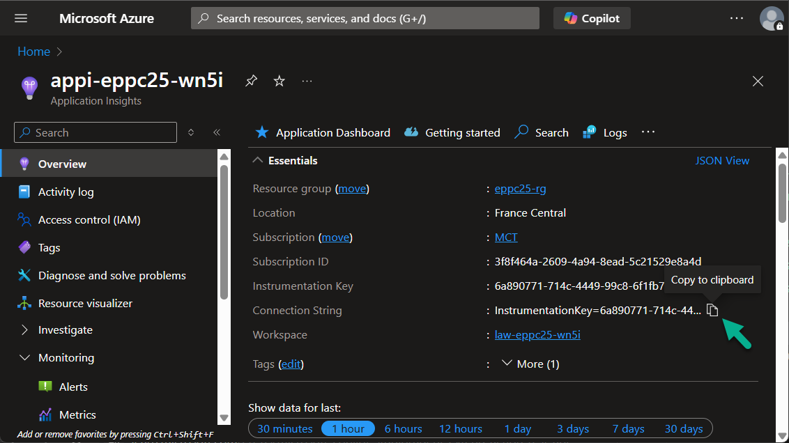
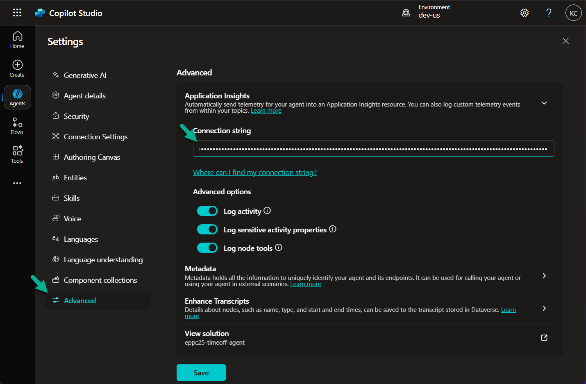
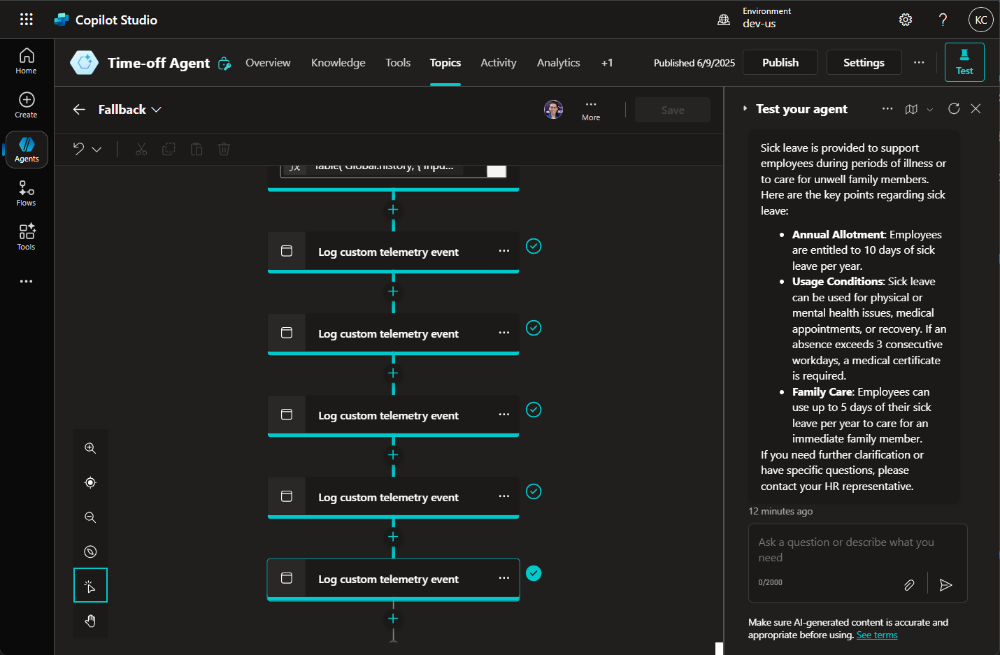

# Lab 13: Capture and review user sessions from Copilot Studio

*In this lab, you will integrate your Copilot Studio agent with Azure Application Insights to capture, monitor, and analyze user interactions and model outputs. By logging both system-generated telemetry and custom events (like RAG chunks returned from Prompt Flow), you’ll gain deep visibility into the end-to-end conversation flow.*

*This enables you to:*

*- Trace conversations at the message and topic level*

*- Analyze generated content (e.g., search results or chunks)*

*- Improve observability and debug your agent’s behavior more effectively*

## Integrate Copilot Studio with Azure Application Insights

1. Open the **Azure Application Insights** resource deployed in [Lab 4](../module-2/lab2-4.md). The resource name should look like: `appi-eppc25-<CUSTOM_SUFFIX>`.

2. In the **Overview** tab, copy the **Connection String**.

    

3. Open your agent in Copilot Studio.

4. Navigate to **Settings**, then expand the **Advanced** section.

5. In the **Application Insights** section, paste the connection string into the **Connection String** field.

6. Click **Save** to apply the changes.

    

***

## Update the Fallback topic

*To capture document chunks returned from the Prompt Flow, you will add custom telemetry nodes to the Fallback topic.*

1. Open the **Fallback** topic in Copilot Studio.

2. Open the topic in the **Code editor**.

3. Scroll to the end and paste the following YAML code:

```
    - kind: LogCustomTelemetryEvent
      id: EPPC01
      eventName: chunk1
      properties: |-
        =Table(
            {
                activity: System.LastMessage.Id,
                chunk: Index(Topic.response.chunks.docs,1).content
            }
        )

    - kind: LogCustomTelemetryEvent
      id: EPPC02
      eventName: chunk2
      properties: |-
        =Table(
            {
                activity: System.LastMessage.Id,
                chunk: Index(Topic.response.chunks.docs,2).content
            }
        )

    - kind: LogCustomTelemetryEvent
      id: EPPC03
      eventName: chunk3
      properties: |-
        =Table(
            {
                activity: System.LastMessage.Id,
                chunk: Index(Topic.response.chunks.docs,3).content
            }
        )

    - kind: LogCustomTelemetryEvent
      id: EPPC04
      eventName: chunk4
      properties: |-
        =Table(
            {
                activity: System.LastMessage.Id,
                chunk: Index(Topic.response.chunks.docs,4).content
            }
        )

    - kind: LogCustomTelemetryEvent
      id: EPPC05
      eventName: chunk5
      properties: |-
        =Table(
            {
                activity: System.LastMessage.Id,
                chunk: Index(Topic.response.chunks.docs,5).content
            }
        )
```

4. Click **Save** to apply changes.

    > 💡 This code adds five `LogCustomTelemetryEvent` actions that send individual document chunks returned from Prompt Flow to Application Insights.

***

## Publish the Agent

1. Click **Publish** in the top-right corner of Copilot Studio.

2. In the pop-up dialog, confirm by clicking **Publish** again.


***

## Test the Agent

1. Once published, open the **Test** pane in Copilot Studio.

2. Send a sample message to your agent, e.g.: `tell me about sick leave`.

3. Verify that all steps in the **Fallback** topic execute successfully. The chunks should now be logged as custom events in Application Insights.

    

***

## View Logs in Azure Application Insights

1. Open the **Azure Application Insights** resource linked to your agent.

2. Navigate to the **Logs** section under **Monitoring**.

3. From the table selector, choose the **customEvents** table.

4. Explore the log entries:

    - You'll see built-in events such as **BotMessageSend**, **TopicAction**, etc.
    - You’ll also see custom events like **chunk1**, **chunk2**, … from your fallback telemetry nodes.

    > Custom events allow you to track exactly what content was returned by the Prompt Flow, improving transparency and traceability of agent behavior.

***

## Use KQL to search and filter events

1. While in the **Logs** view, switch to **KQL mode**.

2. Paste and run the following query:

```
customEvents
| where name == "BotMessageReceived" or name == "BotMessageSend" or name == "chunk1" or name == "chunk2" or name == "chunk3" or name == "chunk4" or name == "chunk5"
| project
timestamp,
name,
session_Id,
message = tostring(customDimensions.text),
replyActivity = tostring(customDimensions.replyActivityId),
to = tostring(customDimensions.recipientName),
from = tostring(customDimensions.fromName),
conversation = tostring(customDimensions.conversationId),
chunks = tostring(customDimensions.SerializedData)
| extend chunksJson = todynamic(chunks)
| extend activity = chunksJson[0].activity
| project-away chunksJson
```

3. Click **Run** to execute the query.

4. Review the output to explore:

    - Which chunks were returned per user question
    - Who the sender and recipient were
    - When the messages were exchanged

