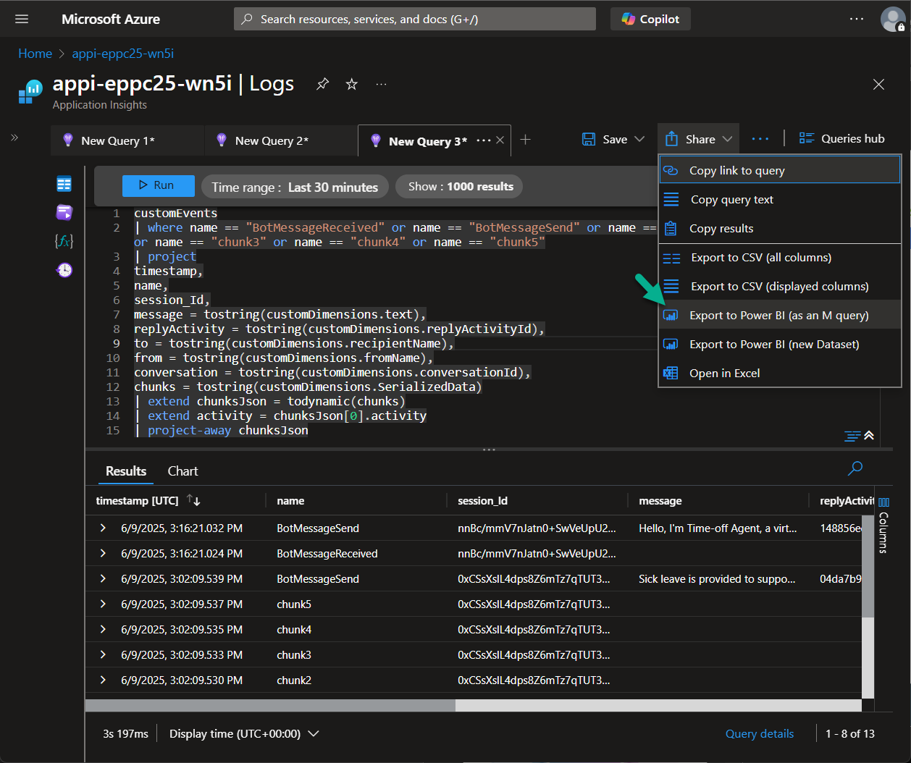
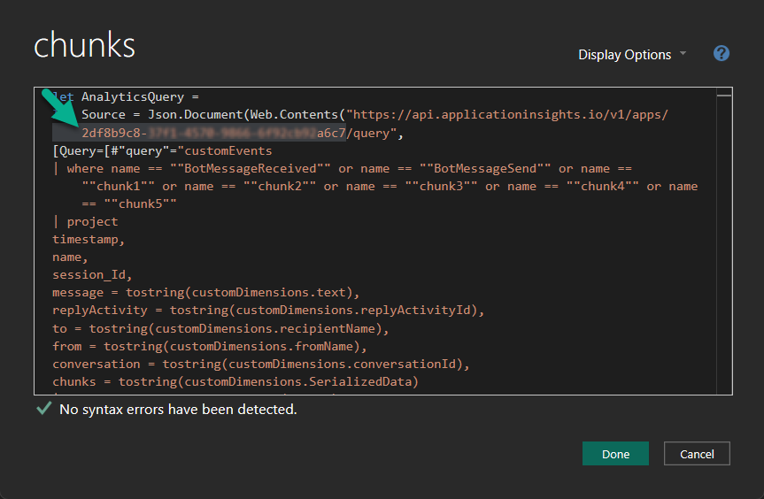
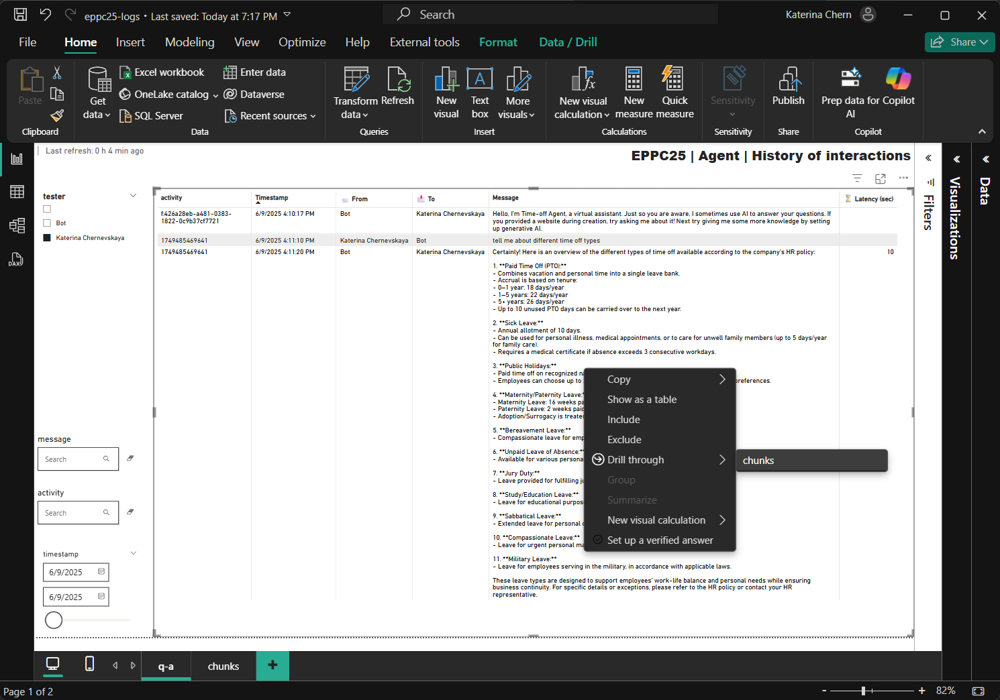

# Lab 14: (Optional) Export telemetry to Power BI

*In this optional lab, you'll connect Azure Application Insights to Power BI to visualize real user telemetry from your published Copilot Studio agent. This enables deeper analysis of user interactions, system behavior, and chunk-level insights over time.*

> ⚠️ Note: In this Lab only interactions from the published agent (not from the test pane in Copilot Studio) will be captured in the telemetry used for Power BI visualization.

## Prerequisites

To collect telemetry that includes the user's display name, follow these steps:

1. Publish your agent in Copilot Studio.

2. Configure the **Teams** channel for your agent.

3. Open the agent in Microsoft Teams and send a message that triggers a knowledge response - for example: `Tell me about PTO.`

***

## Export data to Power BI

1. Open your **Azure Application Insights** resource and go to the **Logs** section.

2. Select the **customEvents** table and run the query you used in [Lab 13](./lab4-13.md) (or another query of your choice).

3. Click the **Share** button and choose **Export to Power BI (M Query)**.
This will generate a script you can copy into Power BI's Power Query Editor.

    

***

## Update the Power BI report

1. Open the provided Power BI report file: [Power BI report "eppc25-logs.pbix"](./power-bi/eppc25-logs.pbix) from the **power-bi** folder.

2. Go to the **Home** tab and open **Transform data** to launch the **Power Query Editor**.

3. In the **Queries** panel, select the **chunks** table.

4. Open the **Advanced Editor**, and replace the `appid` with the one provided in the export script from Application Insights.

    

5. Repeat the same process for the **history** table.

6. Click **Edit Credentials** when prompted.

7. Choose **Organizational account** and sign in using the Azure account associated with the Application Insights resource.

8. Click **Close & Apply** to apply your changes and refresh the dataset.

9. Explore the updated report:

    📈 View recent user activity

    ⏱️ Analyze response latency

    📚 Drill into retrieved document chunks used by Prompt Flow

    
